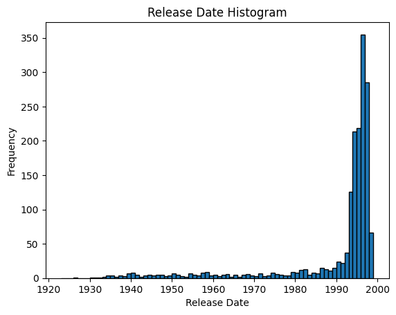
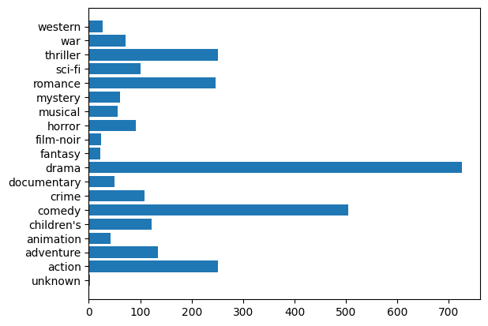
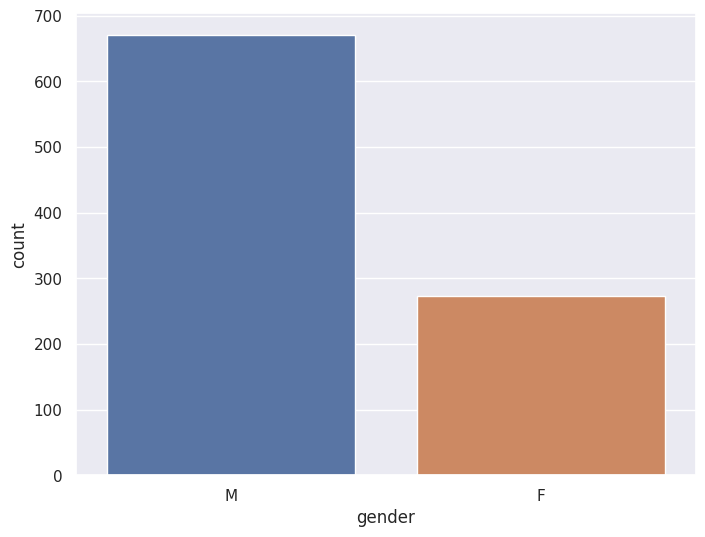
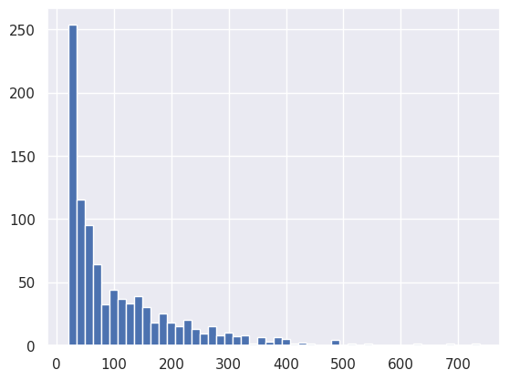
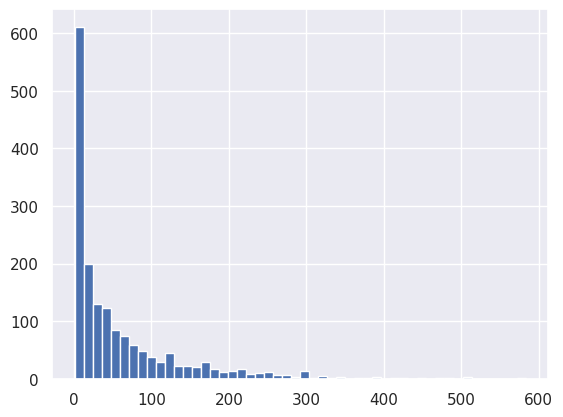

# Introduction
Recommendation systems play a pivotal role in enhancing user experience 
and engagement across various online platforms. In the field of recommendation
systems the MovieLens dataset stands as a benchmark for evaluating and
developing advanced recommendation algorithms. This dataset comprises 
a rich collection of user ratings for movies, offering insights into 
user preferences and behaviors. As an integral part of the broader
field of machine learning and data science, recommendation systems 
aim to predict user preferences and suggest personalized content, 
fostering a more tailored and enjoyable experience. In this assignment,
we used the MovieLens 100K dataset [1], exploring its structure, 
characteristics, and the application of recommendation algorithms.
Through this analysis, we aim to gain a deeper understanding of the 
challenges and opportunities inherent in recommendation systems.
# Data analysis
The movie lens dataset consists of 943 users, 1682 movies, and
100000 ratings.  
The movies are represented by id, title,
release date, video_release_date, IMDb_URL, and 19 encoded genres.
The video_release_date was None for all films, and url does not have
any helpful information, so I dropped them. I decided to leave the title to
create a more user-friendly representation of recommendations. The dates were
distributed as following:  
 In the genre distribution we can see a shift towards drama and comedy genres:
  
Now let us explore a little bit the users' demographic info: it consists of 
id, age, gender, occupation (one of 21), and zipcode. The zipcode column primary 
contains unique values, so it is not helpful for our model, and it was dropped.
The gender consists of 2 genders (in correspondence with Russian laws),
male and female, with domination of male raters:  
 This information was encoded 
binary, 1 for male, 0 for female. Now let us take a look at occupation distribution
  
We can see that several occupations dominate over others, while some of them 
are underrepresented and can negatively affect the quality of learning. The occupation
info was encoded using OneHotEncoder. The next
thing to consider is gender distribution. 
  
The age is distributed more or less evenly in range from ~15 to ~55 with an outlier
in ~30 years, ages less and more are represented poorly.

Finally, let's take a look at rating distribution.
  
We can see that most of the ratings are somehow positive, so users tend to
like the movies they watch (the task becomes a bit simpler). These pictures show
how many movies were rated by each user and how many grades has received each movie:
 

 
The pictures show, that there are many movies that were rated by a small amount of users.
This may become (it has become, actually) a bottleneck, because we do not have enough
info about the movies to know what kind of users like them

# Model Implementation
To choose the model for the task I used the benchmarking website [2]. I
have chosen the current state-of-the-art model [3]. It was implemented in [4], 
so some of the elements were taken from there. Also, I compared the metrics with
this implementation, because the authors did not share their code, and how they achieved their
metrics is unclear.  
The model scheme is the following:
1. The users are connected with each other in a graph if they have more than
alpha similar ratings for different movies.
2. The following metrics of the received graph are calculated for each user:
- Pagerank
- Degree centrality
- Closeness centrality
- Betweenness centrality
- Load centrality
- Average neighbour degree
3. The data is concatenated with the users' demographic information.
4. The user information is passed to a 5 layer autoencoder to reduce the
dimensionality of the data.
5. The resulting data is clustered using k-means algorithm

# Training Process
# Model Advantages and Disadvantages
...
# Evaluation
...
# Results
...